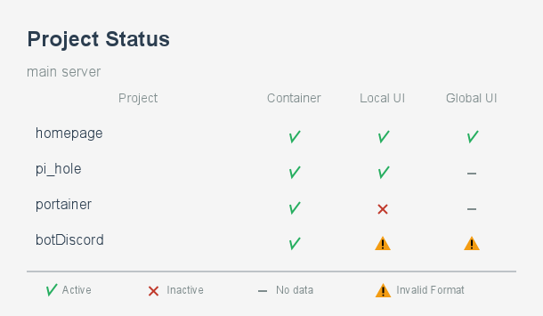

# MetricSnap

MetricSnap is a service that generates dynamic PNG images visualizing server metrics and project statistics. It provides a simple API to create beautiful, informative metric snapshots that can be embedded anywhere.

## Features

- 🖼️ Generate PNG images with server metrics and project states
- 📊 Visualize system resources usage (CPU, RAM, Disk)
- ⚡ Real-time data rendering
- 🔄 Easy integration with any monitoring system
- 🎨 Clean and modern design

## Quick Start

```bash
# Install dependencies
npm install

# Start the server
npm start
```

The server will run on http://localhost:3000

## API Usage

### Server State Endpoint

Generate an image with server metrics:

```http
GET /api/v1/serverState?data={jsonData}
```

Example request:

```http
GET /api/v1/serverState?data={"title":"Server Stats Example","subtitle":"Current Server Usage","uptime":"1 day, 2:30","dataSource":[{"name":"CPU","usedPercent":"25"},{"name":"RAM","total":"16GB","used":"8GB","left":"8GB","usedPercent":"50"},{"name":"Disk","total":"512GB","used":"128GB","left":"384GB","usedPercent":"25"}]}
```

Generated image example:


### Project State Endpoint

Generate an image with project state information:

```http
GET /api/v1/projectState?data={jsonData}
```

#### Example 1 - Mixed Interface Types

```http
GET /api/v1/projectState?data={"title":"Project Status","subtitle":"main server","dataSource":[{"name":"homepage","container":"true","interface":{"local":true,"global":"true"}},{"name":"pi_hole","container":"true","interface":{"local":"true"}},{"name":"portainer","container":true,"interface":{"local":"false","global":false}},{"name":"botDiscord","container":"true","interface":false}]}
```

Generated image:



#### Example 2 - Simple Interface Values

```http
GET /api/v1/projectState?data={"title":"Project Status","subtitle":"main server","dataSource":[{"name":"homepage","container":"true","interface":true},{"name":"pi_hole","container":"true","interface":"true"},{"name":"portainer","container":true,"interface":false},{"name":"botDiscord","container":"true"}]}
```

Generated image:


## Installation

1. Clone the repository:
```bash
git clone https://github.com/Sergiy3013/MetricSnap.git
cd MetricSnap
```

2. Install dependencies:
```bash
npm install
```

3. Copy and configure environment variables:
```bash
cp example.env .env
```

4. Start the server:
```bash
npm start
```

## Requirements

- Node.js 14.0 or higher
- npm

## Dependencies

- `dotenv` - Environment variables management
- `express` - Web framework
- `canvas` - Image generation
- `ejs` - Template engine

## Support

If you like this project, you can support me:

- [monobank](https://send.monobank.ua/jar/2MWaHtwB8y)

## Author

[Sergiy3013](https://github.com/sergiy3013)